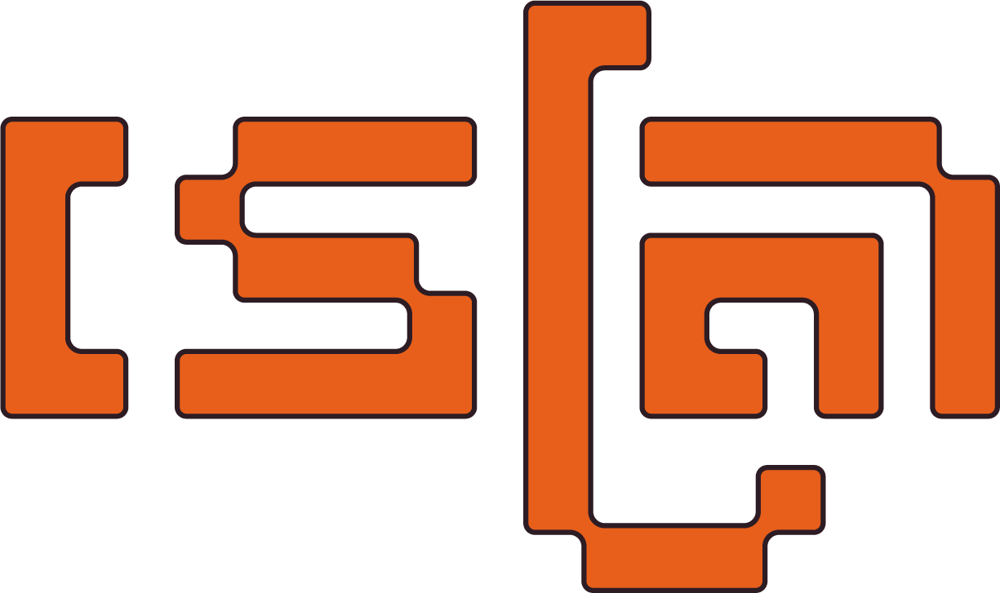
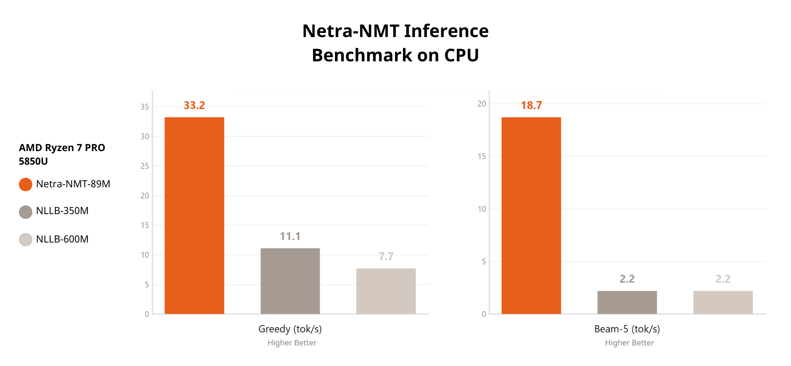
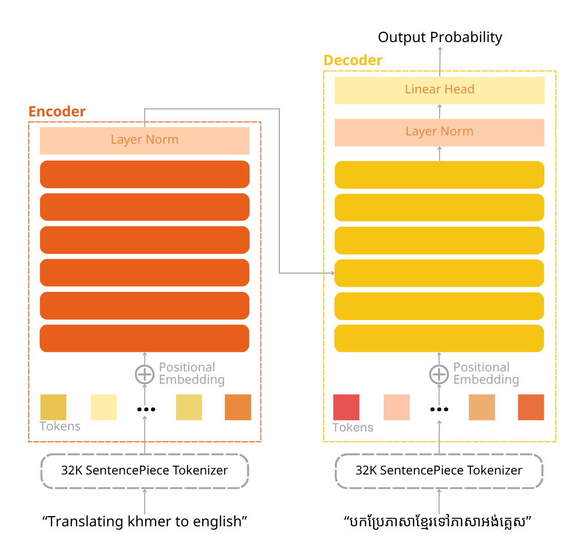
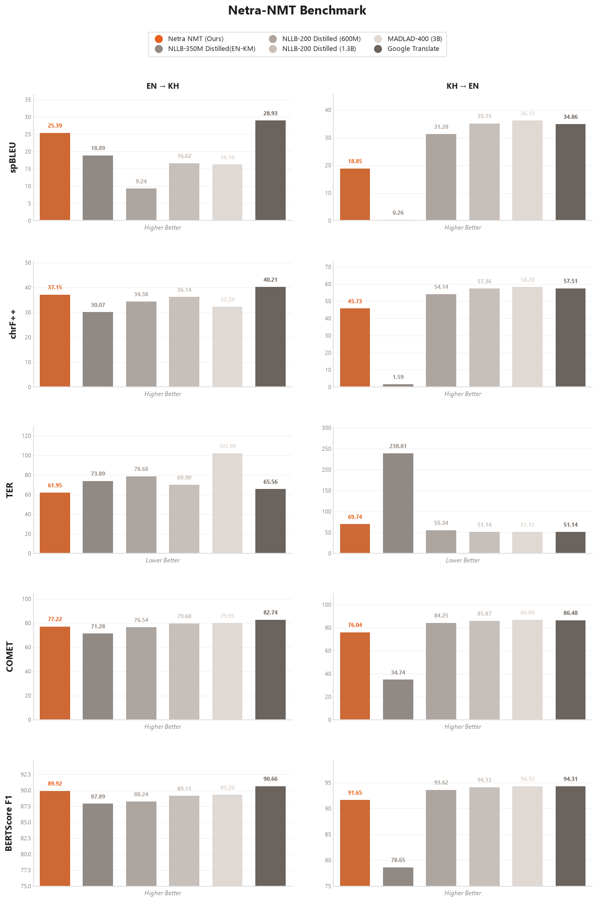

<div align="center">
  
  
</div>

<hr>

<p align="center">
 <a href="https://github.com/netra-ai-lab/Netra-NMT"><b>GitHub</b></a> |
  <a href="https://huggingface.co/Darayut/netra-nmt-small"><b>Model Download</b></a> |
    <a href="https://huggingface.co/datasets/Darayut/bilingual-en-km"><b>Dataset Download</b></a> |
    <a href="https://huggingface.co/spaces/Darayut/Netra-NMT"><b>Inference Space</b></a> |
</p>

<h2>
<p align="center">
  <a href="">A Compact Bidirectional Encoder-Decoder Transformer-Based Model for English-Khmer Translation</a>
</p>
</h2>

<p align="center">

</p>

<p align="center">
<a href="">Inference Speed Benchmark on CPU Using Greedy, and Beam Search Decoding Strategy</a>       
</p>

## 1. Abstract
This repository present Netra-NMT a 90M-parameter encoder-decoder transformer-based model trained on **220 million tokens** of English-Khmer parallel text (4.2M bidirectional examples). The encoder uses bidirectional self-attention, much like BERT, to capture global contextual representation. The decoder perform autoregressive generation through causal self-attention and encoder-decoder cross attention.

Unlike traditional transformer block, Netra-NMT incorporates several architectural improvements, including Pre-Layer Normalization (Pre-LN) for stable optimization, SwiGLU feed-forward networks for enhanced representational capacity, and weight tying between the decoder embedding layer and output projection head to reduce parameter redundancy.

## 2. Dataset

Netra-NMT was trained on **220 million tokens** drawn from approximately **2.4 million unique English-Khmer sentence pairs** (4.2 million examples after bidirectional augmentation). The corpus combines LLM-generated synthetic data with web-crawled parallel text, spanning legal, literary, medical, technical, and conversational domains.

### 2.1 Sources

| Dataset | Type | Pairs | Domains |
|---------|------|------:|---------|
| [Darayut/khmer-english-pairs-raw](https://huggingface.co/datasets/Darayut/khmer-english-pairs-raw) | Synthetic | 200K | Legal, Literary, Governmental |
| [lyfeyvutha/nllb-en-km-316K](https://huggingface.co/datasets/lyfeyvutha/nllb-en-km-316K) | Synthetic | 316K | General |
| [KrorngAI/ParaCrawl-English-Khmer-v2](https://huggingface.co/datasets/KrorngAI/ParaCrawl-English-Khmer-v2) | Web crawl (ParaCrawl) | 1.5M | Web / general |
| [SeyhaLite/Translate-English-Khmer-All](https://huggingface.co/datasets/SeyhaLite/Translate-English-Khmer-All) | --- | 366K | General |
| **Total** | | **2.4M** | |

### 2.2 Preprocessing

Raw data was cleaned through the following pipeline:

1. **Deduplication**: exact duplicate pairs removed across all sources.
2. **Length filtering**: pairs with extreme source/target length mismatches were discarded.
3. **Empty/null removal**: pairs where either side was empty or below a minimum token count were dropped.

After cleaning, each surviving pair is duplicated in both directions (`EN→KM` and `KM→EN`) with a direction prefix token (`<2km>` / `<2en>`), yielding ~4.2 million training examples.

## 3. Model Architecture

<div align="center">
  
  <p><em>Figure 1: Overview of the Netra-NMT encoder-decoder architecture. The encoder (left) processes the source sentence with bidirectional self-attention; the decoder (right) generates the target sentence autoregressively via causal self-attention and cross-attention over the encoder output. Both sides share a 32K SentencePiece tokenizer.</em></p>
</div>

Netra-NMT follows a standard encoder-decoder transformer architecture with several modifications for training stability and parameter efficiency.

**Encoder**  takes the source sentence tokenized by the shared 32K SentencePiece tokenizer, adds learned positional embeddings, and passes the sequence through 6 transformer layers with *bidirectional* self-attention (every token attends to every other token, similar to BERT). A final Pre-LN layer norm is applied to the encoder output before it is passed to the decoder via cross-attention.

**Decoder** takes the (partially generated) target sentence through the same tokenizer, adds positional embeddings, and passes it through 6 transformer layers. Each decoder layer applies three sub-layers in order: (1) *causal* (masked) self-attention over previously generated tokens, (2) cross-attention over the full encoder output, and (3) a feed-forward block. A final Pre-LN layer norm feeds into the tied linear projection head to produce output token probabilities.

**Architectural improvements over the vanilla transformer:**

| Feature | Detail |
|---------|--------|
| Pre-Layer Normalization | Layer norm applied *before* each sub-layer (Pre-LN) rather than after, improving gradient flow and training stability |
| SwiGLU FFN | Feed-forward blocks use the SwiGLU activation instead of ReLU, providing richer representational capacity at no parameter cost |
| Weight tying | The decoder input embedding matrix is shared with the output linear projection head, reducing redundant parameters |

**Hyperparameters:**

| | |
|---|---|
| d_model | 512 |
| Encoder / Decoder layers | 6 / 6 |
| Attention heads | 8 |
| FFN hidden size | 2048 |
| Vocabulary | 32K (SentencePiece unigram, shared) |
| Total parameters | ~89.7M |

## 4. Evaluation Results

<p align="center">

</p>

## Install

```bash
pip install netra-nmt              # core (Python API + CLI)
pip install "netra-nmt[web]"       # + FastAPI web app & REST API
```

Or from source:

```bash
git clone https://github.com/NDarayut/netra-nmt
cd netra-nmt
pip install -e ".[web]"
```

The first translation downloads the weights (~180 MB fp16) from the Hugging Face Hub and caches them
under `~/.cache/huggingface`.

## Usage

### 1. Python API

```python
from netra_nmt import NetraTranslator

t = NetraTranslator()                       # auto-detect GPU/CPU; downloads weights once
t.translate("Hello, how are you?", direction="en2km")   # → "សួស្តី សុខសប្បាយអត់?"
t.translate("ខ្ញុំស្រឡាញ់ប្រទេសរបស់ខ្ញុំ។", direction="km2en")

# Batch + decoding options
t.translate_batch(["Good morning.", "See you tomorrow."], direction="en2km")
t.translate("Good morning, my friend.", direction="en2km", mode="beam", beam_size=5)
```

One-shot helper (caches a default translator):

```python
from netra_nmt import translate
translate("Hello", direction="en2km")
```

`direction` is `"en2km"` (English→Khmer) or `"km2en"` (Khmer→English).
`mode` is `"greedy"` (default), `"beam"`, or `"sample"`.

### 2. CLI

```bash
# Single sentence (default direction en2km):
netra-translate --text "Hello, how are you?"

# Khmer → English with beam search:
netra-translate --text "សួស្តី, តើអ្នកសុខសប្បាយទេ?" --direction km2en --mode beam

# Translate a file (one sentence per line):
netra-translate --file input.txt --output output.txt --direction en2km

# Interactive REPL (omit --text / --file):
netra-translate
```

### 3. Web app + REST API (FastAPI)

```bash
netra-web                      # serves the web UI + API at http://127.0.0.1:8000
netra-web --port 8080 --device cpu
netra-web --local-dir export   # load weights from a local export dir
```

A two-pane translation site (source left, output right, EN⇄KM swap button) plus a JSON API:

```bash
curl -X POST http://127.0.0.1:8000/api/translate \
  -H 'Content-Type: application/json' \
  -d '{"text": "Hello, how are you?", "direction": "en2km"}'
# {"translation": "...", "direction": "en2km"}
```

Requires the `web` extra (`pip install "netra-nmt[web]"`).